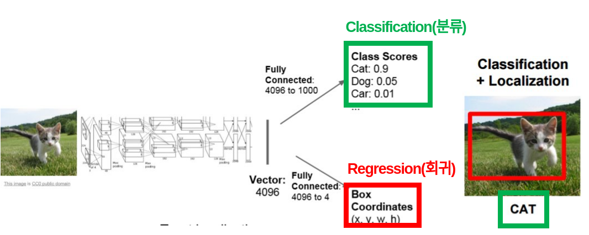
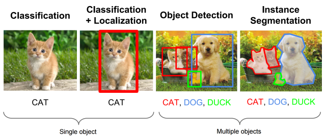
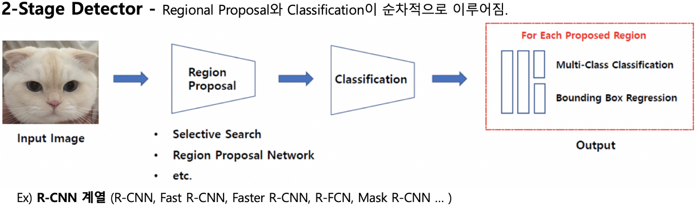
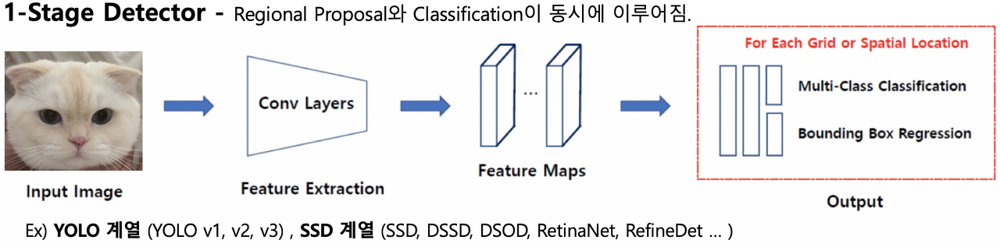
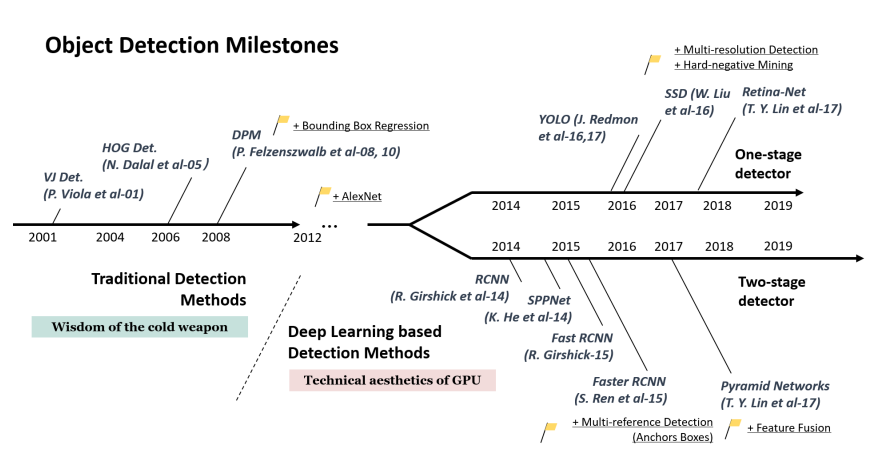
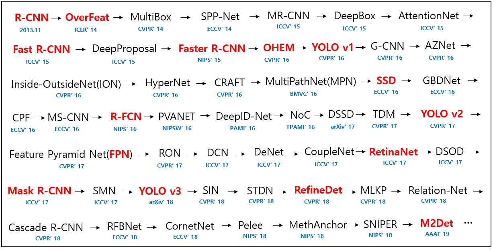
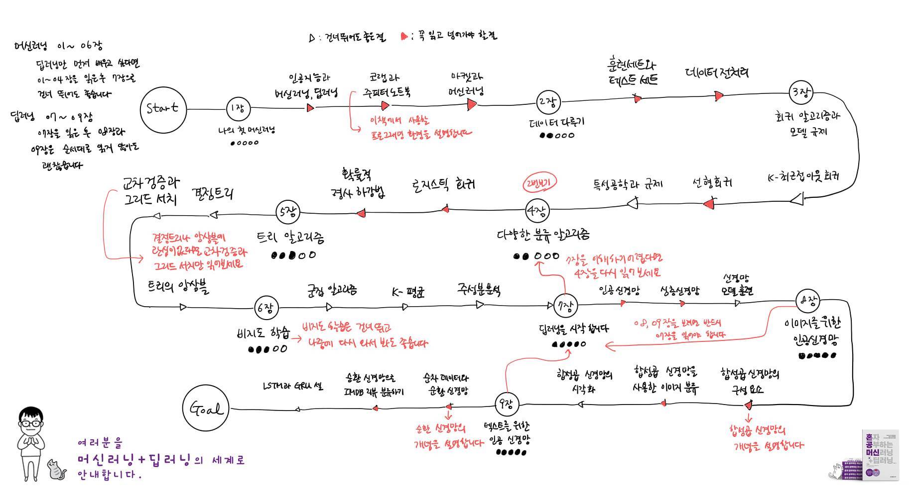

# ML 엔지니어로 살아남기

### ML 워크플로

### ML 엔지니어 분류
1. 데이터 엔지니어(Data Engineer or Data System Developer) - 데이터를 수집하고 관리하며 유지하는 업무를 수행 (데이터 분석 : X , 비즈니스적 인사이트 도출 : X)
2. 데이터 분석가(Data Analyst) - 통계 기법을 활용하여 비즈니스에 어떻게 도움이 될 수 있을지를 분석하고 통찰력을 제공
3. 데이터 과학자(Data Scientist) = 데이터 엔지니어 + 데이터 분석가
4. 머신러닝 수행 엔지니어(AI/ML Engineer)
5. 응용 소프트웨어 엔지니어

## ML 엔지니어로서의 목표

**1. dataset 형식을 이해하고 각각의 dataset 변경을 자유롭게**

**2. tensorflow, pytorch(detectron2) 등 딥러닝 프레임워크의 전환을 자유롭게**

**3. 생성된 모델을 web, mobile, embeded 로 deploy를 자유롭게**

## ML > Vision > Object Detection

[왜 지금 ML이 뜨는 걸까](https://tensorflow.blog/%EC%BC%80%EB%9D%BC%EC%8A%A4-%EB%94%A5%EB%9F%AC%EB%8B%9D/1-3-%EC%99%9C-%EB%94%A5%EB%9F%AC%EB%8B%9D%EC%9D%BC%EA%B9%8C-%EC%99%9C-%EC%A7%80%EA%B8%88%EC%9D%BC%EA%B9%8C/)

#### Vision 분야가 핫한 이유
수집 데이터 형식에 따른 분류 - 이미지, 동영상, 텍스트, 음성, 테이블 데이터

[2020년 영상 트래픽 비중, 전체 IP 트래픽의 82%…시스코, VNI 보고서 발표](http://www.techsuda.com/archives/12528)

#### 클라우드([AWS](https://docs.aws.amazon.com/ko_kr/whitepapers/latest/aws-overview/machine-learning.html), [MS Azure](https://azure.microsoft.com/ko-kr/services/machine-learning/), [GCP](https://cloud.google.com/products/ai))를 보면 실제 적용되는 각 분야의 트렌드를 알 수 있다

#### Object Detection
Object Detection(객체 검출) = classification(분류) + localization(지역화)

###### Stage에 따른 분류

###### Milestones

[참고 블로그](https://chacha95.github.io/2020-02-10-Object-Detection1/)

[텐서플로우 Object Detection API](https://github.com/tensorflow/models/tree/master/research/object_detection)

## DATASET
#### DATA 의 중요성 - **머신러닝의 7~80 퍼센트는 데이터다**

참고자료

1. [Object Detection Dataset](https://seol8118.github.io/object%20detection/od-intro2/#)
2. [Object detection dataset 리뷰](https://chacha95.github.io/2020-02-27-Object-Detection4/)

링크

[MNIST 손글씨](http://yann.lecun.com/exdb/mnist/)

[CIFAR-10 dataset (10 object categories)](https://www.cs.toronto.edu/~kriz/cifar.html)

[PASCAL Visual Object Challenge (20 object categories) 2006 ~ 2012](http://host.robots.ox.ac.uk/pascal/VOC/voc2012/index.html)

[ImageNet Large Scale Visual Recognition Challenge (ILSVRC) 2010 ~ 2017](https://image-net.org/challenges/LSVRC/index.php)

[MS COCO dataset](https://cocodataset.org/#home)

[Open Images Dataset](https://storage.googleapis.com/openimages/web/index.html)

##### 대부분은 머신러닝 플랫폼에서 바로 사용할 수 있도록 서비스하고 있으며 새로운 데이터세트는 현재 [Kaggle](https://www.kaggle.com/) 에서 제공되고 있다.

## 딥러닝 프레임워크
[파이토치가 텐서플로우를 이겼다(2020.10)](http://www.aitimes.com/news/articleView.html?idxno=132756)

1. [파이토치 - 페이스북](https://tutorials.pytorch.kr/)

2. [텐서플로우 - 구글](https://www.tensorflow.org/?hl=ko)

## 모델 선정
1. [Detectron2 Model Zoo (PyTorch)](https://github.com/facebookresearch/detectron2/blob/master/MODEL_ZOO.md)

2. [텐서플로우 Object Detection API Model Zoo (Tensorflow)](https://github.com/tensorflow/models/blob/master/research/object_detection/g3doc/tf2_detection_zoo.md)

## 학습, 평가, 결과 테스트 
1. [Detectron2 Colab 실습](https://colab.research.google.com/drive/16jcaJoc6bCFAQ96jDe2HwtXj7BMD_-m5)

2. 소스코드 설명

## 추천 강의 및 블로그
1. Stanford 대학의 ML Vision 유투브 강의

	[유투브 강의](https://www.youtube.com/playlist?list=PLC1qU-LWwrF64f4QKQT-Vg5Wr4qEE1Zxk)
		
	[한글자막](https://github.com/visionNoob/CS231N_17_KOR_SUB)

2. [텐서 플로우 블로그](https://tensorflow.blog/)

## 앞으로.......
