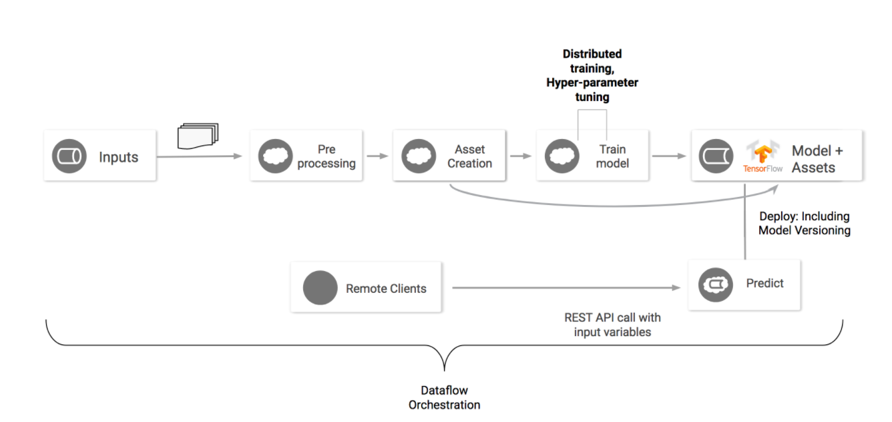
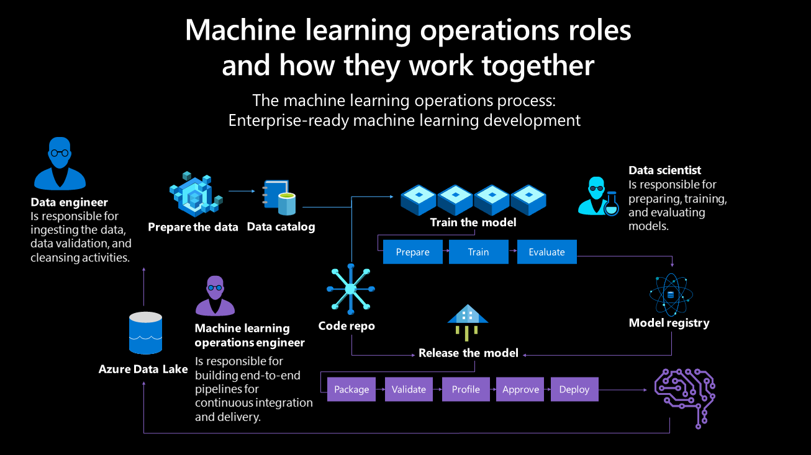
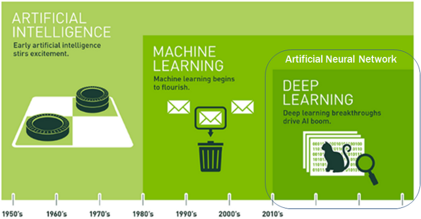
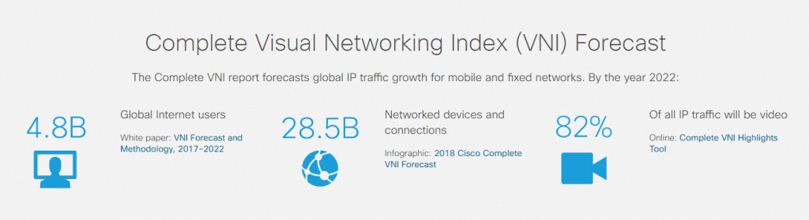
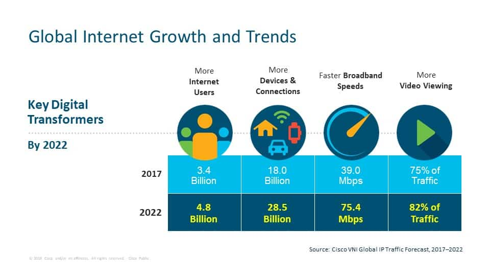
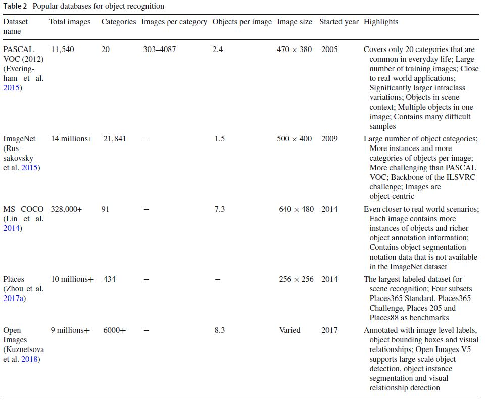

# ML 엔지니어로 살아남기

### ML 워크플로

### ML 엔지니어 분류
1. 데이터 엔지니어(Data Engineer or Data System Developer) - 데이터를 수집하고 관리하며 유지하는 업무를 수행 (데이터 분석 : X , 비즈니스적 인사이트 도출 : X)
2. 데이터 분석가(Data Analyst) - 통계 기법을 활용하여 비즈니스에 어떻게 도움이 될 수 있을지를 분석하고 통찰력을 제공
3. 데이터 과학자(Data Scientist) = 데이터 엔지니어 + 데이터 분석가
4. 머신러닝 수행 엔지니어(AI/ML Engineer)
5. 응용 소프트웨어 엔지니어

## ML 엔지니어로서의 목표

**1. dataset 형식을 이해하고 각각의 dataset 변경을 자유롭게**

**2. tensorflow, pytorch, detectron2 등 학습도구의 사용을 자유롭게**

**3. 생성된 모델의 deploy 를 자유롭게 web, mobile, embeded 등**

## ML > Vision > Object Detection

[왜 지금 ML이 뜨는 걸까](https://tensorflow.blog/%EC%BC%80%EB%9D%BC%EC%8A%A4-%EB%94%A5%EB%9F%AC%EB%8B%9D/1-3-%EC%99%9C-%EB%94%A5%EB%9F%AC%EB%8B%9D%EC%9D%BC%EA%B9%8C-%EC%99%9C-%EC%A7%80%EA%B8%88%EC%9D%BC%EA%B9%8C/)

#### Vision 분야가 핫한 이유
수집할 데이터 형식 - 이미지, 동영상, 텍스트, 음성, 테이블 등

[2020년 영상 트래픽 비중, 전체 IP 트래픽의 82%…시스코, VNI 보고서 발표](http://www.techsuda.com/archives/12528)

### DATASET 

참고자료

1. [Object Detection Dataset](https://seol8118.github.io/object%20detection/od-intro2/#)
2. [Object detection dataset 리뷰](https://chacha95.github.io/2020-02-27-Object-Detection4/)

링크

[MNIST 손글씨](http://yann.lecun.com/exdb/mnist/)

[CIFAR-10 dataset (10 object categories)](https://www.cs.toronto.edu/~kriz/cifar.html)

[PASCAL Visual Object Challenge (20 object categories) 2006 ~ 2012](http://host.robots.ox.ac.uk/pascal/VOC/voc2012/index.html)

[ImageNet Large Scale Visual Recognition Challenge (ILSVRC) 2010 ~ 2017](https://image-net.org/challenges/LSVRC/index.php)

[MS COCO dataset](https://cocodataset.org/#home)

[Open Images Dataset](https://cocodataset.org/#home)

##### 대부분은 머신러닝 플랫폼에서 바로 사용할 수 있도록 서비스하고 있으며 새로운 데이터세트는 현재 [Kaggle](https://www.kaggle.com/) 에서 제공되고 있다.

